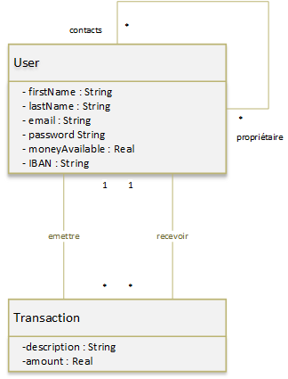
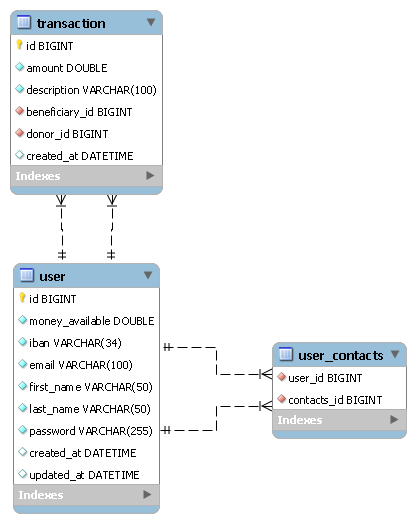

<p align="end">
    
    
</p>
<h1 align="center">Welcome to PayMyBuddy 👋</h1>

## Getting Started

### Prerequisites

- Maven 3.6+
- Install Java 8+
- Mysql 8+

### Database

- Running these commands will create a pay_my_buddy database on your MySQL server

```
mysql -u [username] -p
```

*Enter your MySQL password*

```
CREATE DATABASE `pay_my_buddy`
```

### Configuration

- Copy the file "application.properties.example"
- Rename it to "application.properties"
- Provide the requested configuration information in [bracket].

### Deployment

- place your terminal at the root of the project and run  
  the command lines below

```
 mvn clean deploy -DaltDeploymentRepository=internal.repo::default::file://./target/jar -PROD
```

*deletes all compiled files to start from scratch and compile the program in .jar extension in the target folder located
at the root of the project*

### Start application

- place your terminal at the root of the project and run  
  the command lines below

```
java -jar ./target/paymybuddy-0.0.1-SNAPSHOT.jar
```

***

## More Information

### 🏠 [UML class diagram](.readme/P6_Diagramme_de_classe_UML.png)



### 🏠 [Physical data model](.readme/P6_MPD.png)




